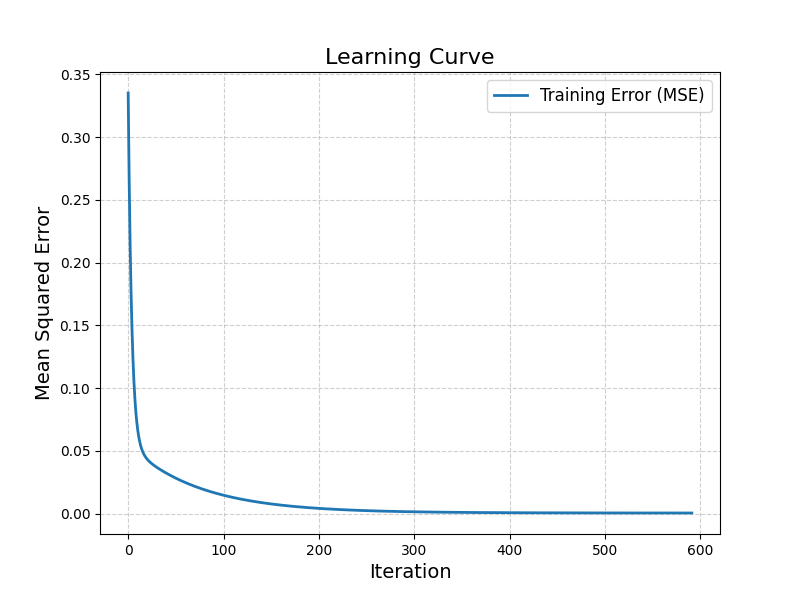

# Linear Regression with Stochastic Gradient Descent

## Overview

This project demonstrates the implementation of a linear regression model trained using Stochastic Gradient Descent (SGD). A sample dataset containing house area (in square feet) and price is used. The data is scaled between 0 and 1 using MinMaxScaler before training. The best fit line and the learning curve of the model are plotted as part of the results.

---

## Steps

### 1. Data Preprocessing

- **Dataset**: The dataset contains two columns: `Area_sqft` (feature) and `Price` (target).
- **Scaling**: Both feature and target values are scaled between 0 and 1 using MinMaxScaler.

  **Formula for Min-Max Scaling:**
  ```
  x' = (x - x_min) / (x_max - x_min)
  ```

### 2. Stochastic Gradient Descent

SGD is used to optimize the weights and bias of the linear regression model. The steps involved are:

#### 2.1 Initialization

- Weights are initialized to 0.
- Bias is initialized to 0.

#### 2.2 Iterative Optimization

Note: To ensure numerical stability during gradient calculation, a small constant (1e-8) is added to the denominator. This prevents division by zero or extremely small values, which can lead to computational errors.

For each iteration:

1. **Predictions:**
   ```
   y_pred = X ⋅ w + b
   ```

2. **Error Calculation:**
   ```
   Error = y_pred - y
   ```

3. **Gradient Calculation:**
   - For weights:
     ```
     dw = (1 / (n + 1e-8)) * sum(X.T * (y_pred - y))
     ```
   - For bias:
     ```
     db = (1 / (n + 1e-8)) * sum(y_pred - y)
     ```

4. **Parameter Update:**
   - Update weights:
     ```
     w = w - learning_rate * dw
     ```
   - Update bias:
     ```
     b = b - learning_rate * db
     ```
     Here, `learning_rate` is the learning rate.

5. **Error Tracking:** Record the mean squared error (MSE):
   ```
   MSE = (1 / n) * sum((y_pred - y)^2)
   ```

6. **Convergence Check:** Stop if the magnitude of `dw` is below a predefined tolerance.

### 3. Model Training

- The model is trained for a maximum of 1000 iterations or until the convergence criteria are met.
- The learning rate is set to 0.1 based on the characteristics of the dataset and training requirements. Users can adjust this value as needed to suit their specific use case.

### 4. Visualizations

- **Best Fit Line:** Plots the data points and the regression line.
- **Learning Curve:** Plots the MSE over iterations to show model convergence.

---

## Files

1. `linear_model.py`: Contains the `SGDRegressor` class that implements the linear regression model.
2. `main.py`: Loads the data, preprocesses it, trains the model, and plots the results.
3. `utils.py`: Contains utilities for data scaling (`Scaler`) and plotting (`Plot`).
4. `data.csv`: Sample dataset with `Area_sqft` and `Price` columns.
5. `requirements.txt`: Lists the dependencies required to run the project.

---

## Usage

1. Place the dataset (`data.csv`) in the project directory.
2. Install the required dependencies:
   ```bash
   pip install -r requirements.txt
   ```
3. Run the `main.py` script:
   ```bash
   python main.py
   ```
4. Visualize the results:
   - Best fit line
   - Learning curve

---

## Results

1. **Best Fit Line:** Demonstrates the linear relationship between scaled area and price.

   
2. **Learning Curve:** Shows how the model's error reduces over iterations, indicating learning progress.

   
